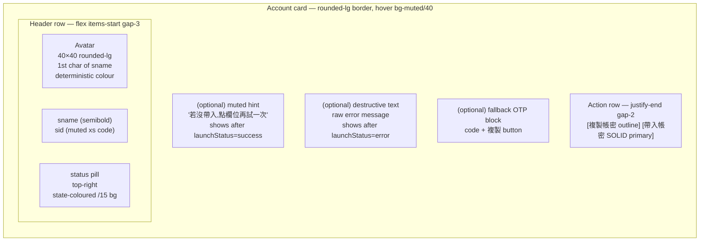

# UI mockups

Source of truth for the front-end layout before code lands. Add a new
section whenever a non-trivial UI change is in flight — mermaid
diagram first, then implement.

The diagrams are intentionally rough. They pin layout / hierarchy
decisions so a reviewer doesn't need to run the app to tell what's
proposed. Tailwind class names and exact pixel sizes live in the
code; this file owns the *shape*.

---

## HomePage — account card (Pass 2)

Shipped in PR #49.

### Status pill colour map

| State        | Label        | Tailwind                                                   |
|--------------|--------------|------------------------------------------------------------|
| `pending`    | 帶入中…       | `bg-blue-500/15 text-blue-700 dark:text-blue-300`           |
| `success`    | ✓ 已送出      | `bg-emerald-500/15 text-emerald-700 dark:text-emerald-300`  |
| `fallback`   | 手動貼上      | `bg-amber-500/15 text-amber-700 dark:text-amber-300`        |
| `no-window`  | 請先按啟動    | `bg-muted text-muted-foreground`                            |
| `error`      | 失敗         | `bg-destructive/15 text-destructive`                        |

### Avatar palette

Six Tailwind colours bucketed by `djb2(sname) mod 6` so the same account
keeps the same colour across renders / restarts / re-logins:
`bg-orange-500`, `bg-blue-500`, `bg-emerald-500`, `bg-purple-500`,
`bg-pink-500`, `bg-cyan-500`.
