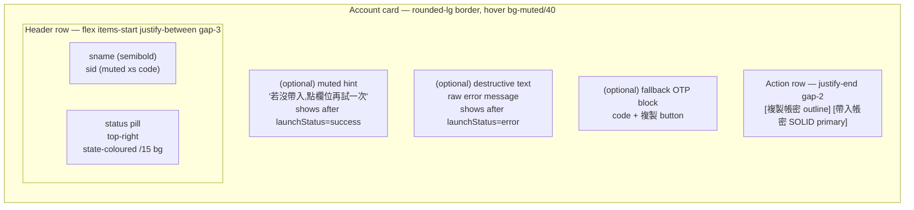
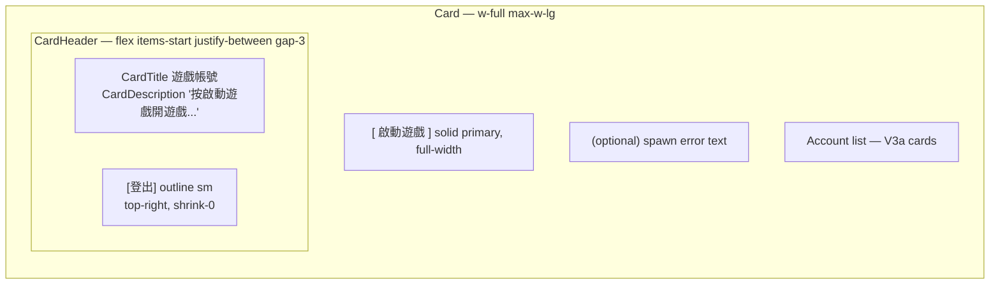

# UI mockups

Source of truth for the front-end layout before code lands. Add a new
section whenever a non-trivial UI change is in flight — mermaid
diagram first, then implement.

The diagrams own *shape* (layout, hierarchy, which controls live
next to which). Tailwind class names and pixel-exact sizes live in
the code; this file owns the intent so a reviewer doesn't need to
run the app to follow a UI PR.

---

## HomePage — account card

Status pill + primary CTA on a flat row; no avatar block.

Earlier iterations briefly experimented with per-account coloured
avatars but the unit was wrong: every `(sname, sid)` row belongs to
the same Beanfun user (game-side sub-accounts), so giving each one
a distinct identity colour was misleading. Stripped back to plain
typography for the row; user-level / game-level branding will land
on the card *header* if/when we surface them.

### Status pill colour map

| State        | Label        | Tailwind                                                   |
|--------------|--------------|------------------------------------------------------------|
| `pending`    | 帶入中…       | `bg-blue-500/15 text-blue-700 dark:text-blue-300`           |
| `success`    | ✓ 已送出      | `bg-emerald-500/15 text-emerald-700 dark:text-emerald-300`  |
| `fallback`   | 手動貼上      | `bg-amber-500/15 text-amber-700 dark:text-amber-300`        |
| `no-window`  | 請先按啟動    | `bg-muted text-muted-foreground`                            |
| `error`      | 失敗         | `bg-destructive/15 text-destructive`                        |

---

## HomePage — overall card layout (Pass 3)

Pass 3 only moves the **登出** button. It previously sat at the bottom
of `CardContent` (centred, outline) and stole vertical space below
the account list. Moved to the top-right corner of `CardHeader` as a
small outline button — small target, always within thumb reach, no
longer pushes the visible content down. The bottom `CardContent`
block now ends with the account list.

`CardHeader` becomes a flex row so the title/description block can
sit on the left and grow, while the button sits on the right and
keeps a fixed size (`shrink-0`).

